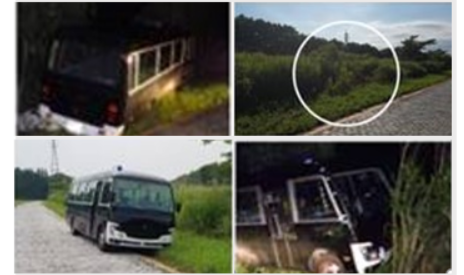

# Lane Detection

## Solution Design

### The idea is to develop a set of programmes to predict the lane and stop the vehicle under certain conditions


Environment:  Windows platform on testing Trucks; Visual Studio

Language: Python, Notebooks, Html5


#### 1. Data Collection & Image Process

* Capture the images from Camera on the trucks
* Take x frames per seconds to process at Pixel level

.png>)

#### 2. Predict the lane path

* Find the lane lines (pixels)
* Create a model to predict the path
* Exceptional case handling (light condition ;  weather ; sharp turn)

.png>)

#### 3. Data Process & Calculation&#x20;

* Define key parameters (center of lane, camera angles, thresholds of deviation, position the truck)
* Trigger the signal to stop the vehicles (integration)

.png>)

#### 4. Continous improvement (Model update, reinforcement training etc) &#x20;
